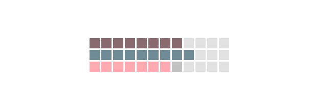

# Abstract-Clock

I always believe in the design of beauty and usability. If the design looks good but loses its practicality, it's a bad design. Thus, I decided to use simple blocks to present useful & accurate information using different colors.

This is a clock with light/dark mode depending on the time in the day. At night, the clock will have a whole different dark color scheme that's easier for the eyes to indicate that it's the night.

Light mode:

Dark mode:

I also divided each set of 12 boxes into three groups with slightly different colors so the user can calculate the time easier.

Enter the demo [here]()
