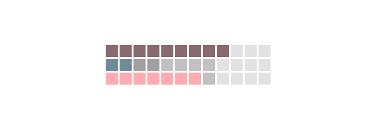

# Abstract-Clock

Enter the demo [here](https://steven-liu48.github.io/Abstract-Clock/)

- This is a clock with light/dark mode depending on the time in the day. At night, the clock will have a whole different dark color scheme that's easier for the eyes to indicate that it's the night.

(Light Mode)

(Dark Mode)

- I also divided each set of 12 boxes into three groups with slightly different colors so the user can calculate the time easier.

(Gradient is shown on the third row that stands for seconds.)
